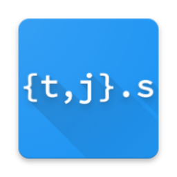

# Touch - Visual Studio Code Extension

[](https://open.vscode.dev/noopRolling/vscode-touch)

---

A Touch-Like command of creating files

_supported by [braces](https://github.com/micromatch/braces)_

## Features

Now we can use all patterns expand by `braces` to create files.

## How to Use

```sh

$ touch a{1..3}.{js,css}
$ ls

-rw-r--r--     1 noop  staff     0B  7 12 15:34 a1.css
-rw-r--r--     1 noop  staff     0B  7 12 15:34 a1.js
-rw-r--r--     1 noop  staff     0B  7 12 15:34 a2.css
-rw-r--r--     1 noop  staff     0B  7 12 15:34 a2.js
-rw-r--r--     1 noop  staff     0B  7 12 15:34 a3.css
-rw-r--r--     1 noop  staff     0B  7 12 15:34 a3.js
```

> Tip: Check [braces](https://github.com/micromatch/braces) for patterns detials.

## Release Notes

### 1.1.0

Added features braces support to create files

---

**Enjoy!**
